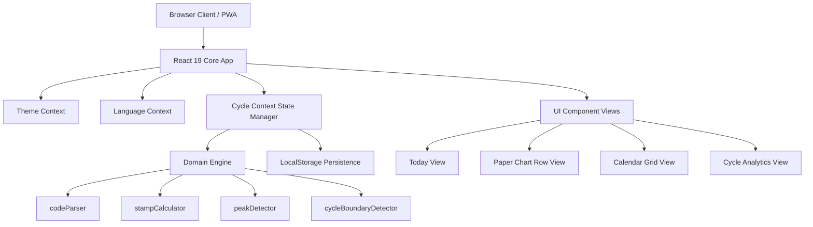
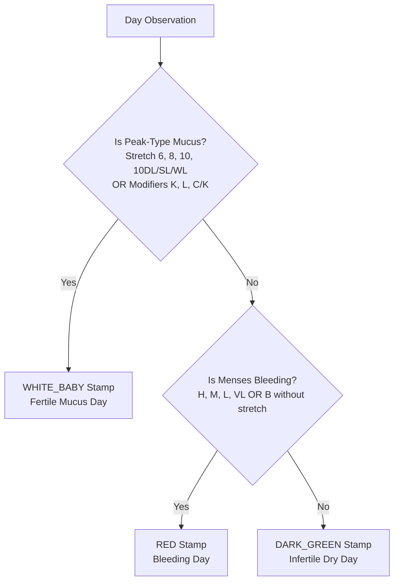

# Fertility Tracker Specification

**Document Version:** 1.4.0  
**Status:** Approved  
**Last Updated:** July 31, 2026  
**Repository:** [github.com/gsuquet/fertility-tracker](https://github.com/gsuquet/fertility-tracker)

---

## Table of Contents

1. [Executive Summary](#1-executive-summary)
2. [System Architecture & Technology Stack](#2-system-architecture--technology-stack)
3. [Domain Engine Specification (CrMS Rules)](#3-domain-engine-specification-crms-rules)
   - [3.1 Biomarker Codes catalog](#31-biomarker-codes-catalog)
   - [3.2 Code Parser Engine](#32-code-parser-engine)
   - [3.3 Stamp Calculation Rules](#33-stamp-calculation-rules)
   - [3.4 Peak Day & Post-Peak Detector](#34-peak-day--post-peak-detector)
   - [3.5 Cycle Boundary Detector](#35-cycle-boundary-detector)
   - [3.6 Version Tracker Engine](#36-version-tracker-engine)
4. [Data Schemas & Type System](#4-data-schemas--type-system)
5. [User Interface & Views](#5-user-interface--views)
   - [5.1 Navigation & Global Controls](#51-navigation--global-controls)
   - [5.2 Cycle Stats Header](#52-cycle-stats-header)
   - [5.3 Today View (Dashboard)](#53-today-view-dashboard)
   - [5.4 Paper Chart Row View](#54-paper-chart-row-view)
   - [5.5 Monthly Calendar Grid View](#55-monthly-calendar-grid-view)
   - [5.6 Cycle Analytics View](#56-cycle-analytics-view)
   - [5.7 Observation Drawer](#57-observation-drawer)
   - [5.8 Export & Printing System](#58-export--printing-system)
   - [5.9 Version Tracker & System Info Modal](#59-version-tracker--system-info-modal)
   - [5.10 Welcome Screen & Onboarding Guide Modal](#510-welcome-screen--onboarding-guide-modal)
6. [State Management & Data Persistence](#6-state-management--data-persistence)
7. [Internationalization & Design System](#7-internationalization--design-system)
8. [Testing & Quality Assurance](#8-testing--quality-assurance)
9. [Deployment & CI/CD Pipeline](#9-deployment--cicd-pipeline)
10. [Legal, Privacy & Medical Compliance](#10-legal-privacy--medical-compliance)

---

## 1. Executive Summary

**Fertility Tracker** is a privacy-first web application designed for tracking, charting, and analyzing
female reproductive health using the standardized **Creighton Model FertilityCare™ System (CrMS)**.

Unlike conventional period tracking applications that rely on opaque statistical calendars or period
prediction algorithms, Fertility Tracker implements standardized clinical CrMS charting logic. It parses
natural biomarker observations—such as cervical mucus stretch, color, consistency, sensation, bleeding
codes, and frequency—to dynamically determine stamp colors, calculate Peak Day ($P$), count post-peak fertile/infertile
transitions ($P+1, P+2, P+3$), and delineate cycle boundaries.

### Key Objectives

- **Clinical Accuracy:** Strict adherence to standardized Creighton Model biomarker classification and stamping rules.
- **Visual Authenticity:** Paper-style visual chart rows mirroring standard physical Creighton paper charts, alongside interactive calendar grids and analytics.
- **Privacy First:** 100% client-side data processing and local storage without third-party tracking, analytics, or external backend requirements.
- **Exportability:** Native capability to export cycle charts to high-resolution PNG, printable PDF formats, and structured JSON data backups.

---

## 2. System Architecture & Technology Stack

The application is architected as a lightweight, high-performance Single Page Application (SPA) with zero backend runtime dependencies.



### Technology Stack Details

| Layer | Technology | Specification / Version |
| :--- | :--- | :--- |
| **UI Library** | React | `v19.2.8` |
| **Language** | TypeScript | `v7.0.2` (Strict mode, ES2022 target) |
| **Build Tool** | Vite | `v8.1.5` |
| **Icons** | Lucide React | `v1.27.0` |
| **Styling** | Custom Vanilla CSS | CSS Custom Properties, Glassmorphism, CSS Grid/Flexbox |
| **Testing** | Vitest & React Testing Library | `vitest v4.1.10`, `@testing-library/react v16.3.2`, `jsdom v30.0.0` |
| **Deployment** | Cloudflare Pages | `@cloudflare/wrangler v4.115.0` |

---

## 3. Domain Engine Specification (CrMS Rules)

The Domain Engine is isolated in `src/domain/` with pure, deterministic logic independent of the React UI layer.

### 3.1 Biomarker Codes Catalog

The Creighton Model system uses standardized alphanumeric tokens to record daily observations:

#### Bleeding Codes

- `H`: Heavy Bleeding (Menses)
- `M`: Moderate Bleeding (Menses)
- `L`: Light Bleeding (Menses)
- `VL`: Very Light Bleeding / Spotting
- `B`: Brown Bleeding / Discharge

#### Mucus Stretch Codes

- `0`: Dry / No Mucus
- `2`: 1/4 inch stretch
- `2W`: 1/4 inch stretch, Watery
- `4`: 1/2 inch stretch
- `6`: 3/4 inch stretch
- `8`: 1 inch stretch
- `10`: $\ge 1$ inch stretch (Stretchy)
- `10DL`: Damp, Lubricative
- `10SL`: Shiny, Lubricative
- `10WL`: Wet, Lubricative

#### Mucus Modifier Codes

- `B`: Brown
- `C`: Cloudy
- `C/K`: Cloudy/Clear
- `G`: Gummy
- `K`: Clear
- `L`: Lubricative
- `P`: Pasty / Peasty
- `Y`: Yellow

#### Frequency Codes

- `X1`: Observed 1 time during the day
- `X2`: Observed 2 times during the day
- `X3`: Observed 3 times during the day
- `AD`: Observed all day

#### Symptom & Intercourse Codes

- `AP`: Abdominal Pain / Ovulation pain
- `RAP`: Right Abdominal Pain
- `LAP`: Left Abdominal Pain
- `I`: Intercourse occurred on this day

---

### 3.2 Code Parser Engine

**Module:** [src/domain/codeParser.ts](./src/domain/codeParser.ts)

The parser operates in two directions:

1. **Formatting (`formatCodeString`):** Concatenates structured observation attributes into canonical Creighton order:  
   `[Bleeding] [Stretch][Modifiers] [Frequency] [Intercourse]`  
   *Note:* Symptom codes (`AP`, `RAP`, `LAP`) are intentionally excluded from `codeString` so that symptoms are strictly rendered in dedicated symptom badges/sections below the observation code.  
   *Example:* `10KL X3 I` or `H` or `2W X2`.
2. **Parsing (`parseCodeString`):** Softly parses freeform text input entered by users, splitting tokens by whitespace, recognizing valid stretch prefixes (e.g. `10WL`, `2W`, `10`), extracting modifiers (e.g. `C/K`, `K`, `L`), identifying frequencies, symptoms (`AP`, `RAP`, `LAP`), and the `I` intercourse flag.

---

### 3.3 Stamp Calculation Rules

**Module:** [src/domain/stampCalculator.ts](./src/domain/stampCalculator.ts)

The `calculateStamp` function classifies each day's observation into one of the standardized CrMS stamp categories:



---

### 3.4 Peak Day & Post-Peak Detector

**Module:** [src/domain/peakDetector.ts](./src/domain/peakDetector.ts)

1. **Peak Day ($P$) Determination:**
   - **Automatic Mode:** Scans observations chronologically within a cycle and identifies the **last consecutive day** exhibiting Peak-type mucus characteristics (stretch $\ge 6$ or clear/lubricative qualities `K`, `L`, `C/K`).
   - **Manual Override Mode:** Respects user-set `isManualPeak` flag or cycle-level `manualPeakDate`.
2. **Post-Peak Phase Transition ($P+1, P+2, P+3$):**
   - The three days immediately following Peak Day ($P+1, P+2, P+3$) are assigned specialized post-peak baby stamps:
     - $P+1 \rightarrow$ `LIGHT_GREEN_BABY_1`
     - $P+2 \rightarrow$ `LIGHT_GREEN_BABY_2`
     - $P+3 \rightarrow$ `LIGHT_GREEN_BABY_3`
   - These stamps visually remind users of the post-peak fertile count window.

---

### 3.5 Cycle Boundary Detector

**Module:** [src/domain/cycleBoundaryDetector.ts](./src/domain/cycleBoundaryDetector.ts)

- Automatically groups a raw timeline of observations into distinct menstrual cycles.
- A **new cycle boundary** is triggered when menses bleeding (`H`, `M`, `L`, `VL`) occurs after non-bleeding or dry days.
- Output cycles are returned ordered newest-to-oldest, with recalculated relative `cycleDay` indices (Day 1, 2, 3...) calculated relative to each cycle's start date.

---

### 3.6 Version Tracker Engine

**Module:** [src/domain/versionTracker.ts](./src/domain/versionTracker.ts)

- **Version & Release History Management:** Maintains structured release entries (`VERSION_HISTORY`) detailing version tags, release dates, titles, taglines, and feature highlights (e.g. `v1.1.0` release notes).
- **Runtime Metadata:** Retrieves application version from Vite build-time constants (`__APP_VERSION__`, `__BUILD_DATE__`) falling back to `package.json` specifications.
- **Version Update Tracking:** Evaluates user's last-seen version stored in `localStorage` (`fertility_tracker_last_seen_version`) via `checkAndRecordVersionSeen()`.
- **Storage Footprint Diagnostics:** Calculates live browser storage usage statistics via `getStorageStats()`, parsing stored observations in `fertility_care_observations` and running cycle boundary detection to measure exact cycles and observations count.

---

## 4. Data Schemas & Type System

**Module:** [src/types/crms.ts](./src/types/crms.ts)

```typescript
export type BleedingCode = 'H' | 'M' | 'L' | 'VL' | 'B';

export type MucusStretch = '0' | '2' | '2W' | '4' | '6' | '8' | '10' | '10DL' | '10SL' | '10WL';

export type MucusModifier = 'B' | 'C' | 'C/K' | 'G' | 'K' | 'L' | 'P' | 'Y';

export type FrequencyCode = 'X1' | 'X2' | 'X3' | 'AD';

export type SymptomCode = 'AP' | 'RAP' | 'LAP';

export type StampType = 
  | 'RED'                  // Bleeding menses
  | 'DARK_GREEN'           // Infertile dry day
  | 'WHITE_BABY'           // Fertile mucus day
  | 'LIGHT_GREEN_BABY_1'   // Post-peak day 1
  | 'LIGHT_GREEN_BABY_2'   // Post-peak day 2
  | 'LIGHT_GREEN_BABY_3';  // Post-peak day 3

export interface Observation {
  id: string;
  date: string;              // YYYY-MM-DD
  cycleDay: number;          // 1, 2, 3...
  bleeding?: BleedingCode;
  stretch?: MucusStretch;
  modifiers?: MucusModifier[];
  frequency?: FrequencyCode;
  symptoms?: SymptomCode[];
  intercourse?: boolean;     // 'I' marker
  notes?: string;
  isManualPeak?: boolean;    // Manual Peak override flag
  stamp: StampType;
  codeString: string;        // Formatted code string e.g. "10KL X3 I"
  isPeakDay?: boolean;       // Designated Peak Day ('P')
}

export interface Cycle {
  id: string;
  startDate: string;         // YYYY-MM-DD
  observations: Observation[];
  manualPeakDate?: string;
  notes?: string;
}

export type Language = 'en' | 'fr' | 'es';
export type Theme = 'dark' | 'light';
export type ActiveTab = 'today' | 'chart' | 'calendar' | 'analytics';
```

---

## 5. User Interface & Views

The user interface comprises four primary view tabs, global navigation, header summary stats, an observation drawer, and an export modal.

### 5.1 Navigation & Global Controls

- **Desktop Header ([Header.tsx](./src/components/Header.tsx)):** Displays logo, primary view selector (`Today`, `Chart`, `Calendar`, `Analytics`), Export Button, Welcome Guide Button (`BookOpen` icon), Version/About Info Button, Dark/Light Theme toggle, and Language Switcher (`en`, `fr`). Responsive design automatically hides brand title text on narrow viewports ($\le 480\text{px}$) while scaling the logo icon.
- **Footer ([Footer.tsx](./src/components/Footer.tsx)):** Displays legal and medical disclaimers along with an interactive Help / Onboarding Guide link and Version Badge button (`v1.2.0`) linking to the Version Tracker modal.
- **Mobile Navigation ([MobileNav.tsx](./src/components/MobileNav.tsx)):** Bottom fixed navigation bar optimized for touch devices.

---

### 5.2 Cycle Stats Header

**Module:** [src/components/CycleStatsHeader.tsx](./src/components/CycleStatsHeader.tsx)

Displays key statistics for the currently selected cycle or aggregated cycles:

- **Cycle Selector:** Dropdown to switch between active and historical cycles.
- **Current Cycle Day:** Total days logged in the cycle.
- **Peak Day Indicator:** Displays designated Peak Day (e.g. Day 14) or "Searching...".
- **Post-Peak Luteal Length:** Total days count post-peak ($P+1$ through cycle end).
- **Mucific Score:** Calculated biomarker score summarizing mucus quantity and quality.

---

### 5.3 Today View (Dashboard)

**Module:** [src/components/TodayView.tsx](./src/components/TodayView.tsx)

- **Daily Status Card:** Hero summary card displaying today's date, current cycle day, assigned stamp badge, formatted code string, and intercourse status.
- **Quick Logging Controls:** One-click buttons to log dry day, fertile mucus, bleeding, or open full observation drawer.
- **Recent 5-Day Observation History Card:** Aligned 3-column layout featuring a fixed-width date column, aligned `.recent-stamp-slot` for stamp badges, and single-line observation code string with ellipsis truncation.

---

### 5.4 Paper Chart Row View

**Module:** [src/components/ChartRow.tsx](./src/components/ChartRow.tsx)

- Recreates the visual aesthetic of official Creighton paper chart strips.
- Renders 35 days per row with color-coded stamp blocks:
  - **Red:** Menses bleeding
  - **Dark Green:** Dry infertile day
  - **White with Baby Icon:** Fertile mucus day
  - **Light Green with Baby & Number (1, 2, 3):** Post-peak count days
- Displays day numbers, formatted code strings, intercourse (`I`) flags, and Peak (`P`) markers.
- Allows toggling manual Peak Day designation directly on individual stamp cells.

---

### 5.5 Monthly Calendar Grid View

**Module:** [src/components/CalendarGrid.tsx](./src/components/CalendarGrid.tsx)

- Monthly grid layout displaying observations on their actual calendar date.
- Shows stamp badge color, day code snippet, and intercourse indicator on calendar tiles.
- Clicking any tile opens the Observation Drawer pre-populated for that date.

---

### 5.6 Cycle Analytics View

**Module:** [src/components/CycleAnalyticsView.tsx](./src/components/CycleAnalyticsView.tsx)

- Historical charts and summary metrics across all logged cycles:
  - **Cycle Length Variability:** Min, max, and average cycle duration.
  - **Luteal Phase Health:** Post-peak phase duration monitoring (ideal: 9–16 days).
  - **Mucus Cycle Score Trends:** Tracking mucus quality over time.
  - **Fertility Window Distribution:** Breakdown of fertile vs. infertile days.
- **Mobile Stats Header Visibility:** Retains top `.stats-dashboard` header cards on mobile view while hiding them on Today, Graph, and Calendar views to maximize charting space.

---

### 5.7 Observation Drawer

**Module:** [src/components/ObservationDrawer.tsx](./src/components/ObservationDrawer.tsx)

Interactive slide-over drawer for entering and editing observations with two sync'd input modes:

1. **Interactive Form Builder:** Dropdown selectors for Bleeding, Stretch, Modifiers, Frequency, Symptoms, and Intercourse toggle.
2. **Natural Language String Input:** Freeform text field with real-time parser validation.
3. **Live Stamp & Code Preview:** Real-time preview of the resulting stamp color and code string prior to saving.

---

### 5.8 Export & Printing System

**Modules:** [ExportModal.tsx](./src/components/ExportModal.tsx), [PrintExportView.tsx](./src/components/PrintExportView.tsx), [exportUtils.ts](./src/utils/exportUtils.ts)

- **Standardized Export Filename Generator:** Utilizes `getExportFilename()` to enforce strictly lowercase, dash-separated filenames (`[a-z0-9-]`):
  - **JSON Data Backup & Restore:** Downloads formatted JSON backup files named `fertility-tracker-data-backup-YYYY-MM-DD.json`.
  - **Print / PDF Export Filenames:** Dynamically sets the browser document title prior to `window.print()` to suggest clean PDF filenames (e.g. `fertility-tracker-chart-cycle-1-YYYY-MM-DD` or `fertility-tracker-chart-all-cycles-YYYY-MM-DD`).
- **PNG Image Export:** Renders paper chart view into high-resolution PNG image suitable for digital sharing.
- **Print / PDF Export Layout:** Generates clean, printer-optimized 35-day landscape PDF layout hiding UI chrome and headers:
  - Day of week display is omitted from chart cells to conserve horizontal and vertical space.
  - Observation codes (`codeString`) have spaces removed and support 2-line word wrapping for long codes.
  - Adds a dedicated horizontal line under the observation code at the bottom of each cell for free-form user notes (`obs.notes`).
  - Automatically closes the Export Modal upon triggering print/export and displays a real-time success toast notification.

---

### 5.9 Version Tracker & System Info Modal

**Module:** [src/components/VersionModal.tsx](./src/components/VersionModal.tsx)

- **Accessible Modal Dialog:** Triggered via the `Info` button in the header control bar or the version badge button (`v1.4.0`) in the footer.
- **Tabbed Interface:**
  1. **Release Notes Tab:** Featured card displaying the latest release (`v1.4.0`) with feature highlights, release date, and full changelog history. Past releases feature a clean accordion header (version badge & date only) with title displayed inside the expanded section body.
  2. **System Information Tab:** Diagnostic card displaying App Version, CrMS Specification Version, Build Date, Runtime Environment, Local Storage item count, tracked cycles, logged observations, and total storage footprint in KB, alongside a GitHub open-source repository link with responsive mobile icon layout.
- **Design System Integration:** Uses `var(--bg-surface)`, `var(--bg-primary)`, and `var(--bg-surface-border)` CSS surface tokens for solid background opacity and theme harmony in light and dark modes.

---

### 5.10 Welcome Screen & Onboarding Guide Modal

**Module:** [src/components/WelcomeModal.tsx](./src/components/WelcomeModal.tsx)

- **First-Visit Auto-Popup:** Automatically opens when a user opens the app for the first time (`fertility_tracker_has_seen_welcome` is not present in `localStorage`).
- **Interactive Multi-Step Stepper (4 Slides):**
  1. **CrMS Overview & Privacy First:** Explains natural biomarker charting principles and 100% client-side local storage privacy.
  2. **Biomarker & Stamp Legend:** Interactive visual matrix explaining Red (Bleeding), Dark Green (Dry), Green+Baby (Fertile Mucus), White+Baby (Peak/High Fertility), and Yellow stamps, as well as post-peak counting ($P+1, P+2, P+3$).
  3. **Daily Charting Guide:** Walkthrough of the Today Dashboard, Observation Drawer, Direct Code Entry (`10KL X3 I AP`), and Detailed Selectors.
  4. **Views Tour & Quick Start Launcher:** Introduces Paper Chart, Monthly Calendar, and Cycle Analytics, with interactive actions to **"Explore Demo Data"** (pre-loading sample observations) or **"Start Fresh"**.
- **Accessible Design & Navigation:** Keyboard navigation (`Escape` close, tab trap), step indicator dots, "Previous", "Next", and "Skip" controls, fully translated in English and French.

---

## 6. State Management & Data Persistence

**Module:** [src/context/CycleContext.tsx](./src/context/CycleContext.tsx)

- State managed via React Context (`CycleProvider`).
- **Storage Strategy:** Browser `localStorage` using primary data key `fertility_care_observations` for observations, `fertility_care_lang` for active language, `fertility_care_theme` for theme preference, `fertility_tracker_last_seen_version` for version update tracking, and `fertility_tracker_has_seen_welcome` for onboarding completion state.
- **Automatic Reprocessing:** Any modification (addition, update, deletion, manual peak toggle) automatically triggers reprocessing of cycle boundaries, peak day detection, and post-peak stamps across all cycles.
- **Demo Data Generator:** Built-in sample dataset generator allowing new users to immediately test all views and features with realistic multi-cycle CrMS data.

---

## 7. Internationalization & Design System

### 7.1 Internationalization (i18n)

**Module:** [src/context/LanguageContext.tsx](./src/context/LanguageContext.tsx)

- Supported languages: **English (`en`)**, **French (`fr`)**, **Spanish (`es`)**.
- Context-driven translation dictionary managing view labels, biomarker code explanations, drawer inputs, version tracker strings, and error messages.

### 7.2 Design System & Themes

**Module:** [src/context/ThemeContext.tsx](./src/context/ThemeContext.tsx), [src/styles/index.css](./src/styles/index.css)

- Styled using CSS custom properties (variables) supporting **Dark** and **Light** modes.
- Color Tokens:
  - `--stamp-red`: `#ef4444`
  - `--stamp-dark-green`: `#15803d`
  - `--stamp-white-baby`: `#ffffff`
  - `--stamp-light-green`: `#86efac`
  - Theme-adaptive background (`var(--bg-surface)`, `var(--bg-primary)`), text, border (`var(--bg-surface-border)`), and elevation variables.

---

## 8. Testing & Quality Assurance

The codebase maintains automated tests for domain algorithms and UI components using **Vitest** and **React Testing Library**.

### Test Suite Execution

```bash
npm run test
```

### Key Test Coverage Areas

- `codeParser.test.ts`: Canonical string formatting and freeform string parsing edge cases.
- `stampCalculator.test.ts`: Mucus stretch and modifier stamp assignment accuracy.
- `peakDetector.test.ts`: Automatic peak detection, manual peak overrides, and post-peak $P+1, P+2, P+3$ stamp assignments.
- `cycleBoundaryDetector.test.ts`: Menses onset boundary splitting and cycle day numbering.
- `versionTracker.test.ts`: Version history management, last-seen version tracking, and live storage footprint calculation.
- `VersionModal.test.tsx`: Modal rendering, tab navigation, and keyboard/button close interactions.
- `Component Integration Tests`: Header, Footer, ChartRow, TodayView, CalendarGrid, ExportModal, and ObservationDrawer rendering tests.

---

## 9. Deployment & CI/CD Pipeline

- **Target Platform:** Cloudflare Pages (Static Web Site Deployment).
- **Configuration:** [wrangler.json](./wrangler.json)
  - `name`: `fertility-tracker`
  - `pages_build_output_dir`: `dist`
- **Build Command:**

  ```bash
  npm run build  # executes tsc --noEmit && vite build
  ```

- **Deployment Command:**

  ```bash
  npm run deploy # executes npm run build && wrangler pages deploy dist
  ```

- **CI/CD:** Automated GitHub Actions workflows building and validating Pull Requests and deploying main branch builds to Cloudflare Pages.

---

## 10. Legal, Privacy & Medical Compliance

### Privacy

Fertility Tracker operates with a 100% client-side execution model. All biomarker observations and health data remain strictly within the user's browser local storage. No health data is ever transmitted to remote servers.

### Trademark Notice

`FertilityCare™` and `Creighton Model FertilityCare™ System (CrMS)` are registered trademarks owned by the **Saint Paul VI Institute for the Study of Human Reproduction**. Fertility Tracker is an independent open-source project and is not affiliated with or endorsed by the Saint Paul VI Institute, FCCA, or FCCI.

### Medical Disclaimer

Fertility Tracker is intended solely for personal tracking, record-keeping, and educational purposes. It does not provide medical advice, clinical diagnosis, or treatment. Users should consult a certified FertilityCare Practitioner or Medical Consultant for clinical interpretation.
