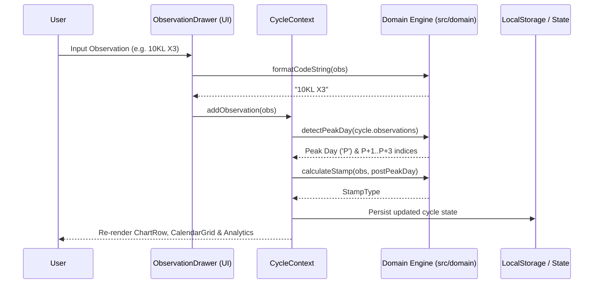

# Explanation: Architecture Overview

This article explains the high-level software architecture, data flow, state management, and design philosophy behind **Fertility Tracker**.

---

## Architectural Principles

1. **Clean Architecture & Separation of Concerns:**
   The business logic of Creighton Model calculations (stamp assignment, code parsing, peak detection) is strictly isolated from React components into pure functions in `src/domain/`.
2. **Framework Agnosticism in Core Logic:**
   Functions in `src/domain/` have no dependencies on React, DOM APIs, or state stores. They are tested independently with Vitest.
3. **Reactive State Management via Context:**
   State is shared predictably through top-level React Context providers (`CycleContext`, `ThemeContext`, `LanguageContext`), avoiding heavy external state libraries.

---

## High-Level Data Flow

---

## State Architecture

- **CycleContext:** Manages cycle creation, daily observation logging, updates, deletions, and manual Peak overrides. Automatically re-evaluates Peak Day detection on state mutation.
- **ThemeContext:** Manages dark/light mode preference and updates root DOM CSS variable attributes (`data-theme`).
- **LanguageContext:** Manages active i18n locale and provides `t(key)` helper for UI string localization.
