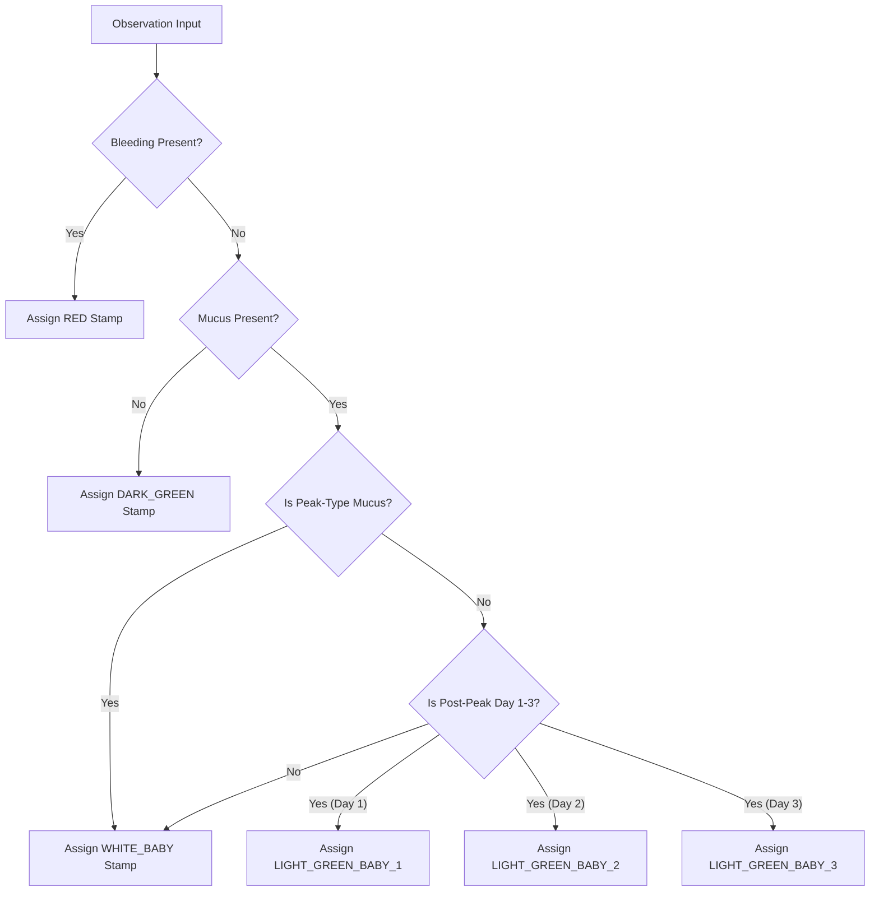

# Reference: CrMS Biomarker Codes & Stamp Rules

This document provides a technical reference for Creighton Model FertilityCare System (CrMS) observation codes, stretch parameters, color modifiers, frequency codes, and automatic stamp calculation rules in **Fertility Tracker**.

---

## 1. Bleeding Codes

Bleeding observations take precedence when assigning red stamps.

| Code | Description               | Stamp Assigned |
| :--- | :------------------------ | :------------- |
| `H`  | Heavy bleeding            | `RED`          |
| `M`  | Moderate bleeding         | `RED`          |
| `L`  | Light bleeding            | `RED`          |
| `VL` | Very Light bleeding       | `RED`          |
| `B`  | Brown bleeding / spotting | `RED`          |

---

## 2. Mucus Stretch Codes

Stretch measurements determine fertility level and Peak-type status.

| Code   | Stretch Measurement             | Description           | Peak-Type Status |
| :----- | :------------------------------ | :-------------------- | :--------------- |
| `0`    | No stretch                      | Dry / Sticky          | Non-Peak         |
| `2`    | 1/4 inch                        | Slight stretch        | Non-Peak         |
| `2W`   | 1/4 inch, watery                | Watery consistency    | Non-Peak         |
| `4`    | 1/2 inch                        | Moderate stretch      | Non-Peak         |
| `6`    | 3/4 inch                        | Moderate-high stretch | Non-Peak         |
| `8`    | 3/4 to 1 inch                   | High stretch          | Non-Peak         |
| `10`   | $\ge 1$ inch                    | Full stretch          | **Peak-Type**    |
| `10DL` | $\ge 1$ inch, damp/lubricative  | High fertility        | **Peak-Type**    |
| `10SL` | $\ge 1$ inch, shiny/lubricative | High fertility        | **Peak-Type**    |
| `10WL` | $\ge 1$ inch, wet/lubricative   | Maximum fertility     | **Peak-Type**    |

---

## 3. Mucus Modifiers

Modifiers describe color, sensation, and consistency.

| Modifier Code | Description          | Fertile Classification |
| :------------ | :------------------- | :--------------------- |
| `B`           | Brown                | Fertile                |
| `C`           | Cloudy               | Fertile                |
| `C/K`         | Cloudy/Clear mixture | **Peak-Type**          |
| `G`           | Gummy                | Non-Peak               |
| `K`           | Clear                | **Peak-Type**          |
| `L`           | Lubricative          | **Peak-Type**          |
| `P`           | Pasty                | Non-Peak               |
| `Y`           | Yellow               | Fertile                |

---

## 4. Frequency Codes

| Code | Meaning                                 |
| :--- | :-------------------------------------- |
| `X1` | Observed 1 time during the day          |
| `X2` | Observed 2 times during the day         |
| `X3` | Observed 3 or more times during the day |
| `AD` | Present All Day                         |

---

## 5. Automatic Stamp Determination Matrix

